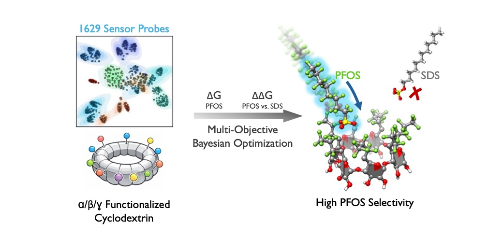

# Selective PFAS Detection with Functionalized Cyclodextrin Probes Designed via Bayesian Optimization

[](#citation)



This repository contains the computational assets associated with a study on cyclodextrin-based molecular recognition of PFAS, with an emphasis on improving PFOS selectivity over structurally similar surfactants such as SDS.

## Citation

**Title:** Selective PFAS Detection with Functionalized Cyclodextrin Probes Designed via Bayesian Optimization

**DOI:** Pending. Replace the badge and this line with the final DOI link after publication, for example:

```md
[](https://doi.org/10.XXXX/XXXXX)
```

## Paper Summary

Per- and polyfluoroalkyl substances (PFAS) are persistent environmental contaminants that demand highly selective molecular recognition strategies for field-deployable detection. `beta`-Cyclodextrin-based field-effect transistor (FET) sensors demonstrate high sensitivity to perfluorooctanesulfonic acid (PFOS), achieving sub-ppt detection limits, yet exhibit limited selectivity in the presence of structurally similar surfactants such as sodium dodecyl sulfate (SDS). Here, we screen a synthetically accessible library of 1,629 functionalized `alpha`-, `beta`-, and `gamma`-cyclodextrins to quantify competitive binding thermodynamics using docking and all-atom molecular dynamics simulations. We identify host architectures with sub-nanomolar PFOS affinity and high selectivity, and use regression analysis to connect binding behavior to structural and electronic descriptors. Together, these results establish quantitative structure-selectivity relationships for cyclodextrin-based PFOS recognition and provide design principles for next-generation PFAS sensing materials.

## Repository Overview

The repository is organized into four main parts:

### [`chem_space_data/`](chem_space_data/)

Chemical-space datasets and structure libraries for the screened cyclodextrin hosts.

- `chem_space.pkl` stores the enumerated library and associated thermodynamic and descriptor fields.
- `chem_space_pdb_files/` contains the candidate 3D structures as PDB files.
- `prim_cleaved_structs/` contains reference alpha-, beta-, and gamma-cyclodextrin scaffolds.
- `analyze_chem_space.py` provides a lightweight way to inspect the dataset contents.

This is the best starting point if you want to understand the screened design space or inspect individual candidates.

### [`metadynamics/`](metadynamics/)

Simulation setup files and helper scripts for the all-atom molecular dynamics and metadynamics workflows used to evaluate host-guest binding.

- example system directories such as `bcd-pfos/`, `bcd-sds/`, and `00464-pfos/`
- shared GROMACS and PLUMED templates in `common.files/`
- helper scripts for generating PLUMED plane definitions and cyclodextrin backbone restraints
- `ff-parameterize/` for guest force-field generation and topology preparation

This is the best starting point if you want to reproduce or inspect the simulation setup workflow.

### [`bayesianoptimization/`](bayesianoptimization/)

Gaussian-process and candidate-ranking utilities used to connect descriptors and MD-derived data to chemical-space prioritization.

- `morganKernel.py` defines additive GP models
- `training.py` contains the model-training loop
- `get_candidates_delta.ipynb` is the interactive analysis notebook
- `data/` stores the serialized training, MD, and candidate datasets used by the modeling workflow

This is the best starting point if you want to inspect the surrogate-modeling and candidate-selection components.

### [`lasso/`](lasso/)

Descriptor-analysis notebook for sparse, interpretable regression on the screened chemical space.

- `lasso.ipynb` loads `chem_space.pkl`
- computes RDKit molecular descriptors and charge-based features for substituent sets
- supports feature selection and regression-style analysis alongside the Bayesian-optimization workflow

This is the best starting point if you want a more interpretable descriptor-based model rather than the Gaussian-process workflow.

## Suggested Entry Points

- Start with [`chem_space_data/README.md`](chem_space_data/README.md) to understand the screened library and stored structures.
- Read [`metadynamics/README.md`](metadynamics/README.md) for the simulation setup and analysis workflow.
- Read [`bayesianoptimization/README.md`](bayesianoptimization/README.md) for the GP modeling and prioritization workflow.
- Open [`lasso/lasso.ipynb`](lasso/lasso.ipynb) for descriptor extraction and sparse regression analysis.

## Notes

- The repository is focused on computational workflow components and intermediate data products rather than a polished software package.
- Several simulation scripts reflect the original HPC environment and may require path updates before reuse on another system.
